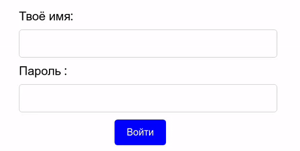
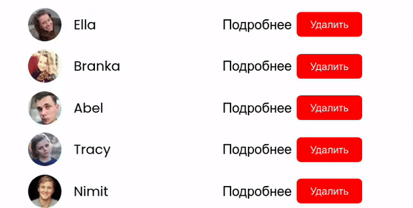
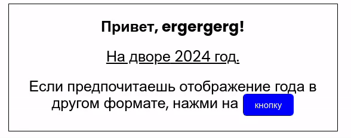

# FriendsNet

**Посмотреть работу приложения: [https://friend-net-rust.vercel.app/](https://friend-net-rust.vercel.app/)**

**FriendsNet** - это приложение, которое демонстрирует мои навыки создания кастомных компонентов, использования базовых хуков React, библиотеки роутинга React Router и работы с формами в React.

В процессе работы над приложением была использована модель ветвления **GitFlow**:

Приложение состоит из различных страниц и компонентов:

## Компонент Button

Компонент **Button** представляет собой переиспользуемую кнопку. Он имеет возможность изменять текст и стили в зависимости от переданных пропсов.

### Атрибуты компонента:

- size - определяет размер кнопки (small, medium или large);
- color - определяет цвет кнопки (blue, green или red);
- onClick - функция, вызываемая при клике на кнопку.

Компонент также может принимать и дефолтные HTML-атрибуты, которые можно передать через пропсы.

**Компонент Button используется в приложении для:**

1. Регистрации:  
   

2. Удаления друзей:  
   

3. Отображения текущего года:  
   

Компонент типизирован, что обеспечивает его надежность и понятность в использовании.

## Работа с формой

Если пользователь не залогинен, то приложение перенаправляет его на страницу /login. На этой странице пользователю предлагается заполнить форму с вводом имени (минимум 3 символа) и пароля (минимум 5 символов). Для отправки данных формы используется компонент Button.

После ввода данных и нажатия на кнопку отправки, форма обрабатывает данные, а затем перенаправляет пользователя на главную страницу.

На главной странице отображается имя, введенное пользователем в форму.

## Работа с базовыми хуками useState и useEffect

После регистрации, приложение отображает пользователю список его друзей. Для загрузки списка друзей используется моковый API https://randomuser.me/api/, и запрос к нему инициируется с помощью хука useEffect. Полученные данные о друзьях хранятся в локальном состоянии с помощью хука useState, а также сохраняются в Local Storage. При выходе из профиля, Local Storage очищается, однако до этого момента данные о друзьях остаются в нем сохраненными.

## Навигация между страницами

Для навигации между страницами в приложении используется библиотека React Router.

- При первом посещении приложения пользователь направляется на страницу входа (/login), где может ввести свои учетные данные. Если пользователь уже вводил данные ранее, они берутся из Local Storage.

- После успешной аутентификации пользователь перенаправляется на главную страницу (/), где отображается список его друзей.

- При клике на одного из друзей выполняется переход на страницу друга с использованием динамического маршрута /friend/:username, где пользователь может посмотреть основную информацию о друге.

- Если пользователь пытается перейти на несуществующую страницу, отображается страница с ошибкой.

## Локальный запуск

1. Скачайте репозиторий, например, с помощью команды git clone в командной строке или загрузив его в архиве с GitHub.
2. Перейдите в папку проекта и выполните следующую команду: npm start.
3. Откройте браузер и перейдите по адресу http://localhost:3000, чтобы увидеть приложение в браузере.
